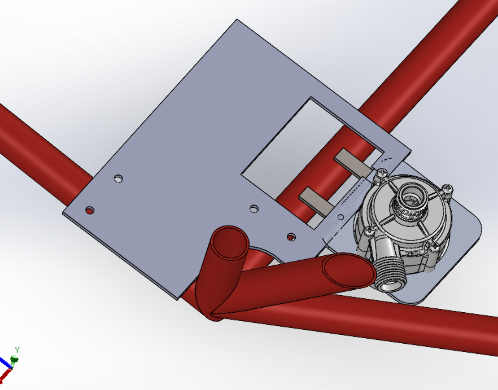

# Jack Carlin-Nguyen — Portfolio

Mechanical Engineering portfolio built for GitHub Pages.

## Setup

1. Create a new GitHub repo named `username.github.io` (or any name for a project page)
2. Upload all files from this folder to the repo
3. Go to **Settings → Pages → Source → main branch → / (root)**
4. Your site will be live at `https://username.github.io`

## Adding Your Images

Replace the placeholder `<div class="beat-img-placeholder">` blocks in `index.html` with actual images:

```html
<!-- Before (placeholder) -->
<div class="beat-img-placeholder">ner-bracket.jpg</div>

<!-- After (real image) -->

```

### Image files needed (put in an `images/` folder):
| Filename | What it is |
|---|---|
| `ner-bracket.jpg` | SolidWorks render of pump mounting bracket |
| `ner-bench-test.jpg` | Bench test setup with flow meter |
| `swirlpot-lid.png` | SolidWorks render of redesigned swirl pot lid |
| `pdm-mockup.jpg` | PDM integration mockup screenshot |
| `solidworks-exploded.png` | STEM toy exploded view |
| `build-prototype.jpg` | Physical prototype photo |
| `robot-intake.jpg` | FTC robot intake mechanism photo |
| `robot-slide.jpg` | FTC robot linear slide + drivetrain photo |

## Customization

All colors are CSS variables at the top of the `<style>` block:
```css
--navy:   #0D1F2D;
--orange: #E8651A;
```
